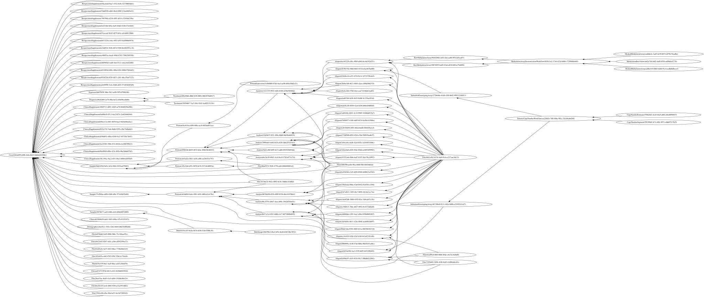

# Welcome to gdcdatamodel2

Repo to keep information about the GDC data model design.

<!-- toc -->

# Table of Contents

- [Installation](#Installation)
- [Testing](#Testing)
- [Update models](#Update-models)
  - [Update Plaster](#Update-Plaster)
  - [Update dictionary](#Update-dictionary)
  - [Generate graph models](#Generate-graph-models)
- [Visualize Graph](#Visualize-Graph)
- [Repo Visualizer](#Repo-Visualizer)

<!-- tocstop -->

This project is a drop-in replacement to the project
https://github.com/NCI-GDC/gdcdatamodel, without challenges and obscurity associated
with using gdcdatamodel. The resulting code will be readable, pass static and linting
checks, completely remove delays from dictionary load times.

# Requirements

- Python >= 3.6

# Installation

To install the gdcdatamodel library run the setup script:

```bash
python setup.py install
```

# Testing

Install dependencies with:

```bash
pip install --no-deps -r dev-requirements.txt
```

Run test with:

```bash
pytest tests
```

# Update models

## Update Plaster

To use a different version of plaster, update the `extras_require.plaster` entry in
[setup.cfg](setup.cfg).

## Update dictionary

To use a different version of gdcdictioanry, update the version value of
profile.gdcdictionary in [plaster.toml](plaster.toml).

## Generate graph models

Generate graph with:

```bash
bash plaster
```

# Visualize Graph

Use following code in jupyterlab to visualize your graph.
```python
from graphviz import Digraph
from IPython.display import display
from gdcdatamodel2 import models
from gdcdatamodel2.viz import create_graphviz

with g.session_scope():
    cases = g.nodes(models.Case).subq_path('samples').limit(1).all()
    case_neighbors = [edge.src for case in cases for edge in case.edges_in]
    samples = [sample for case in cases for sample in case.samples]
    portions = [portion for sample in samples for portion in sample.portions]
    analytes = [analyte for portion in portions for analyte in portion.analytes]
    aliquots = [aliquot for analyte in analytes for aliquot in analyte.aliquots]
    nodes = cases + case_neighbors + samples + portions + analytes + aliquots
    display(create_graphviz(nodes))
```

Example result:



# Repo Visualizer


